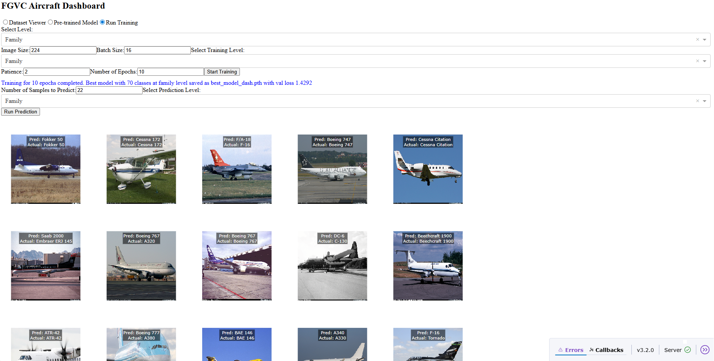

# Capstone Project Team One


```
.___  __ /\                        .__                      ._.
|   |/  |)/ ______ _____    ______ |  | _____    ____   ____| |
|   \   __\/  ___/ \__  \   \____ \|  | \__  \  /    \_/ __ \ |
|   ||  |  \___ \   / __ \_ |  |_> >  |__/ __ \|   |  \  ___/\|
|___||__| /____  > (____  / |   __/|____(____  /___|  /\___  >_
               \/       \/  |__|             \/     \/     \/\/
```

# Multi-class Fine-Grained Visual Classifier for Aircraft using Pytorch

This project is a comprehensive system for retrieving, processing, analyzing, and predicting aircraft PIL images from the "FGVCAircraft" dataset. It consists of four main components:

1. **Data Pipeline (`src`)**: A robust pipeline for retrieving and processing aircraft images data
2. **Model Tuning (`hyperopt_optuna`)**: Applying multiple customized and pretrained models with hyper-parameter searching for the best model
3. **Aircraft Classification (`Base`)**: Using the best model and parameters with deep learning techniques to apply classifying aircraft model variants
4. **Aircraft Classification (`Dashboard`)**: A prototype of beta production dashboard fed with existing dataset and model training and loading capability

## Table of Contents
- [Project Overview](#project-overview)
- [Key Components](#key-components)
  - [Data Pipeline](#data-pipeline)
  - [Model Tuning](#model-tuning)
  - [Aircraft Classification](#aircraft-classification)
- [Directory Structure](#directory-structure)
- [Example Usage](#example-usage)
- [Final Output Dashboard](#final-output-dashboard)
- [Next Steps](#next-steps)
- [Reference](#reference)
- [Contributing](#contributing)


## Project Overview

General Aviation flightline personnel are responsible for servicing a wide variety of aircraft, many of which have unique needs and sometimes unfamiliar configurations. Aircraft servicing mistakes have resulted in many expensive maintenance mishaps and, most seriously, in severalfatality accidents. One of the most critical and costly risks they face is misfueling - introducing the wrong type of fuel into the aircraft.
There are also cases that existing aircraft identification tools are often designed for aviation enthusiasts or casual plane spotters - not for operational use by flightline technicians. project was started to directly address the existing gaps. We aim to deliver an easy to use, real-time aircraft classification model that can run on an edge device for use by General Aviation flightline technicians. A simple image of an aircraft will return the relevant aircraft information along with an accuracy prediction, likely alternatives for comparison, instructions and safety information for routine maintenance and checks, as well as a lock out feature or supervisor override requirements for exceptions. This project is motivated by these key considerations:
- Risk Reduction: reducing the likelihood of costly or fatal servicing errors such as misfueling
- Environmental Efficiency: edge-based image classifiers are up to 10K times more efficient than ChatGPT 4o.
- Operational Reliability: No internet access required increases reliability.
---

## Key Components

### Data Pipeline 

We utilized the Oxford University benchmark dataset Fine-Grained Visual Classification of Aircraft [(FGVC-Aircraft)](https://www.robots.ox.ac.uk/~vgg/data/fgvc-aircraft/). We developed code to check for the dataset locally, and if not available,the code downloads, decompresses, and organizes the dataset into a folder designated for the purpose. The benchmark dataset is well documented and contains 10,000 unlabeled images with accompanying text files that provide labels as needed for each image. In addition, the data is already split into Test, Train, and Validation. Data labels are provided for three levels of aircraft classification from coarse to finer - manufacturer (30), family (70), and variant (100). 

#### Key Features:
 - Simple EDA: We understand that we might not be all familiar with aircraft class models, hence we provide several hierarchical interactive visualization such as Treemap, Sunburst or Sankey to help you get started, `notebooks/Viz.ipynb`.
 - FGVCAircraftDataset: A customized class to better retrieve and direct to the index of images labeled through several .txt files, `src/data_utils.py`.
 - Models: Specialized pipelines for different data types, `src/models.py`
   - Customized CNN: Retrieves flight data with metadata
   - Pre-trained: Such as ResNet50 and EfficientNet
   - Attention-mechanism: such as Context-Aware Attentional Pooling (CAP) and Squeeze-and-Excitation (SE)
 - Utilities: Several customized functions to use throughout the project, `src/aircraft_utils.py`.
 - Transformation: We choose [Albumentationsx](https://albumentations.ai/docs/) over Pytorch default v2 due to efficiency and speed. We resized our images consistently to 224x224 shape throughout our training and evaluation.

### Model Tuning
  The model tuning component uses [Optuna](https://optuna.readthedocs.io/en/stable/), an automatic hyperparameter optimization software framework, particularly designed for machine learning, by first defining an objective function to be optimised (Study). The goal of a Study is to find out the optimal set of hyperparameter values user-defined through invoking several suggest methods of a Trial object to generate hyperparameters, we then set `n_trials=20` for instance to instantiate the process, `notebooks/hyperopt_optuna.ipynb`.

#### Hyper-parameters considered:

 - Models: CAPResNet and SEEffNet, `trial.suggest_categorical('backbone', ['ResNet50_CAP', 'EffNet_SE'])`
 - loss_function: CrossEntropy, LabelSmoothingCrossEntropy and FocalLoss, `trial.suggest_categorical('criterion', ['CrossEntropy', 'LabelSmoothing', 'Focal'])`
 - optimizer: Adam, SGD and RMSprop, `trial.suggest_categorical('optimizer', ['Adam', 'SGD', 'RMSprop'])`
 - scheduler: StepLR, CosineAnnealingLR and ReduceLROnPlateau, `trial.suggest_categorical('scheduler', ['StepLR', 'CosineAnnealingLR', 'ReduceLROnPlateau'])`
 - batch_size: `trial.suggest_categorical('batch_size', [16, 32])`
 - learning_rate: `trial.suggest_float('lr', 1e-5, 1e-2, log=True)`
 - weight_decay: `trial.suggest_float('weight_decay', 1e-6, 1e-2, log=True)`
 - dropout_rate: `trial.suggest_float('dropout_rate', 0.1, 0.5)`


#### Key Features:

 - Model training and evaluation scripts
 - Hyperparameter optimization
 - Comprehensive metrics and visualization tools
 - Prediction capabilities for single flights or batches
 - Analysis tools for model performance and failure cases


### Aircraft Classification 

We apply the best set of hyperparameters just obtained, set early stopping patience at 10 epochs and run for 50-80 epochs using the most conservative top-1 accuracy as our evaluation metric we had achieved 85%, 80% and 68% respectively for our three hierarchy aircraft level. The flight classification component is primarily implemented in Jupyter notebooks for training and evaluation demonstration purpose, `notebooks/Base.ipynb`.

#### Key Techniques:
 - Models, Dropout Rate: We extend our base model to add Context-Aware Attentional Pooling (CAP) with ResNet50 backbone as our core model body with dropout rate set at 0.3563;
 - Loss, Label Smoothing: We apply CrossEntropyLoss Function and leave default label smoothing at 0.1
 - Optimizer, Learning Rate, Weight Decay: Adam optimizer with learning rate is 5.1872e-05 and weight decay set at 0.002925
 - Scheduler: ReduceLROnPlateau
 - Evaluation: Top-k accuracy and F1 score
 - Confusion Matrix: Algorithm for measuring similarity between temporal sequences
 - Heatmap + Lollipop scatter plot: Unsupervised clustering to identify natural groupings of flight patterns
 - Performance Curve: Comparison of flight patterns against predefined prototypes

#### Features:

 - We use top-1 or traditional accuracy score along with F1 score to evaluate a robust model performance; on the follow we also record top-3 accuracy as a looser limitation given different using scenario
 - We visualize a heatmap-style confusion matrix with diagnal line representing the specific top-1 accuracy score for each of the class
 - We extend the confusion matrix to extract the diagnal value to plot a "lollipop" scatter plot for easier view of each class performance
 - Best and worst 5 classes of our model predicted has been plotted
 - Training and Validation Loss vs Accuracy across epochs are visualized as performance curve

---

## Directory Structure

Below is a high-level overview of the repository layout:
<!-- TREE START -->
```text
├── README.md                  # Project overview, setup instructions, usage
├── requirements.txt           # Python dependencies
├── .gitignore                 # Ignore model files, outputs, etc.
│
├── models/                    # Saved PyTorch models (.pth)
│   └── best_model_xxx.pth
│
├── docs/                      # Generated outputs (HTML, PNG, etc.)
│   ├── xxx.png
│   └── interactive_xxx.html
│
├── notebooks/                   # Notebooks (jupyter notebook scripts)
│   ├── Base.ipynb             # Main notebook 
│   ├── Viz.ipynb              # Hierarchical visualization of our datasets
│   └── hyperopt_optuna.ipynb  # hyper-parameter searching scripts
│
├── src/                       # Source code (modular Python scripts)
│   ├── data_utils.py
│   ├── models.py
│   ├── aircraft_utils.py
│   └── hyperopt.py
│
└── apps/                     # Final dashboard
    └── Dashboard.py

```
---
### Interactive .html Link to Visualization
[Click to Open]( https://mabbts.github.io/CV_aircraft_classifier_capstone_project/)


## Example Usage

### Data Pipeline

1. Clone the repo:
```
git clone https://github.com/mabbts/CV_aircraft_classifier_capstone_project.git

cd CV_aircraft_classifier_capstone_project
```
2. (Optional): Create and activate a virtual environment:
```
python -m venv venv
source venv/bin/activate  # macOS/Linux
venv\Scripts\activate     # Windows
```
3. Install requirements:
```
pip install -r requirements.txt
``` 
4. Activate GPU support on PC:
```
pip install torch torchvision torchaudio --index-url https://download.pytorch.org/whl/cu121
```
5. Activate GPU support on Mac M-series chips:
```
pip install torch torchvision torchaudio --index-url https://download.pytorch.org/whl/cpu
```


### Model Tuning

All notebooks and scripts assume the repository root as the working directory.

The hyper-parameters searching is implemented through Jupyter notebooks in `notebooks/hyperopt_optuna.ipynb`. It takes more than 12 hours to execute finding multiple hyper-parameters.

### Aircraft Classification

All notebooks and scripts assume the repository root as the working directory.

The aircraft classification component is primarily implemented in Jupyter notebooks for exploratory analysis and visualization. The main notebook is `notebooks/Base.ipynb`, and `notebooks/Viz.ipynb` for visualization.

To run the final dashboard `apps/Dashboard.py`

```
python Dashboard.py
```
And you should be able to see the dashboard such like:




---

## Final Output Dashboard

We are wrapping all into a production dashboard aiming to give users 3 mode options switchable with radio-buttons built by plotly dash application:

Dataset-Viewer:
 - First select your preferred level out of the three from a drop-down list
 - Click `Load Dataset` to retreive images from right directory
 - Toggle betweeen `Select Class` to view a random set of your desired airfrafts
  
Pre-trained Model:
 - Similarly to choose 1 of 3 levels first
 - Choose how many samples you like to predict, default is 10
 - Click `Run Prediction` to automatically load our pre-trained model parameter as your classifier

Run Training:
 - This option allows users to tweak their own parameters in a more customized fashion rather than sticking to our production version
 - Input all your preferred parameters and click `Start Training`
 - `Run Preiction` to predict with your own trained model, notice that resulted accuracy might not be optimised
   
---

## Next Steps

Data Pipeline:

 - Support for additional aircraft images data sources
 - Real-time aircraft incoming streaming capabilities
   
Model Tuning:

 - Multi-modal prediction incorporating weather data
 - Uncertainty quantification in predictions
 - Ensemble methods combining multiple model types
  
Aircraft Classification:

 - Integration of supervised learning with domain expert labels
 - Anomaly detection for unusual flight patterns
 - Real-time classification capabilities

Applicable Dashboard:

 - Adding in more flexibility for practical cusomization using case
 - Allow for real-time incoming aircraft model recognition capability
   
## Reference
---
The following resources were consulted during the development of this project:

- **Performance Analysis of Deep Learning Algorithms Implemented Using PyTorch in Image Recognition**
[Open Access - ScienceDirect]( https://www.sciencedirect.com/science/article/pii/S1877050924028084)

- **Benchmarking Deep Learning Models on NVIDIA Jetson Nano forcReal-Time Systems: An Empirical Investigation**
[Open Access - ScienceDirect](https://www.sciencedirect.com/science/article/pii/S1877050925010178)

- **Aircraft-Type Classification Using Deep Learning Algorithms**
[IEEE Xplore](https://ieeexplore.ieee.org/abstract/document/10705261)

- **ANALYSIS OF EFFECTIVE IMAGE PROCESSING METRICS ON RASPBERRY PI AND NVIDIA JETSON NANO**
[ResearchGate](https://www.researchgate.net/publication/387534040_ANALYSIS_OF_EFFECTIVE_IMAGE_PROCESSING_METRICS_ON_RASPBERRY_PI_AND_NVIDIA_JETSON_NANO)

- **General Aviation Aircraft Identification at Non-Towered Airports Using a Two-Step Computer Vision-Based Approach**
[IEEE Xplore](https://ieeexplore.ieee.org/document/9770072)

## Contributing
This project is part of a course requirement, but feedback, suggestions, and ideas are welcome! Feel free to open issues or submit pull requests if you have improvements to suggest.

 - Issues: For bug reports or feature requests
 - Pull Requests: We welcome code contributions—please be sure to include clear descriptions and testing steps


